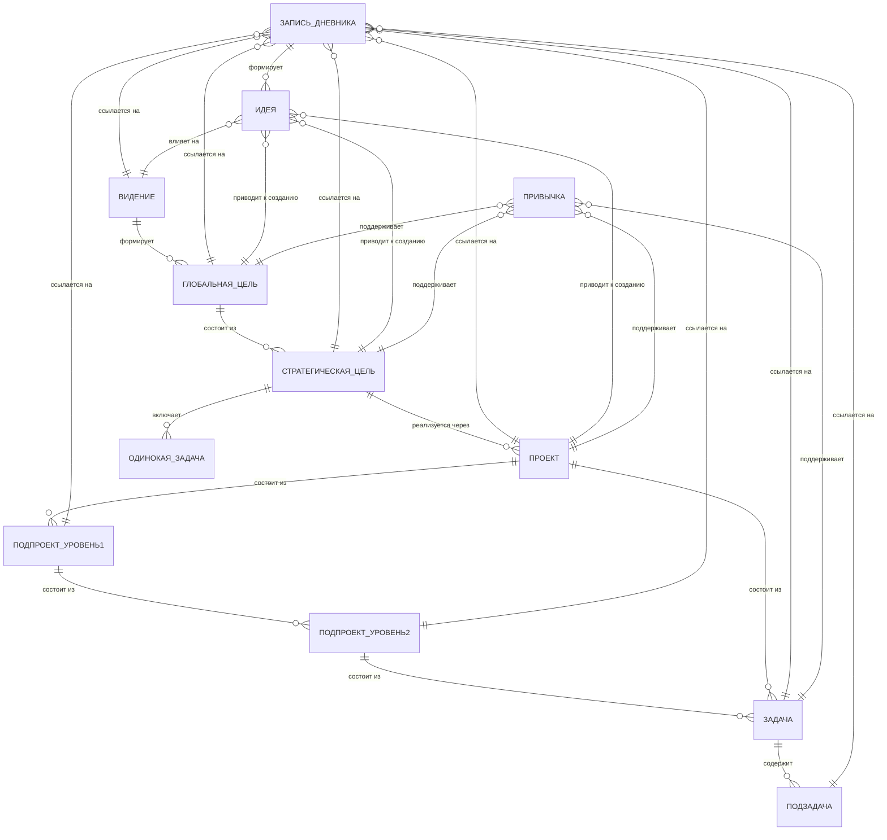
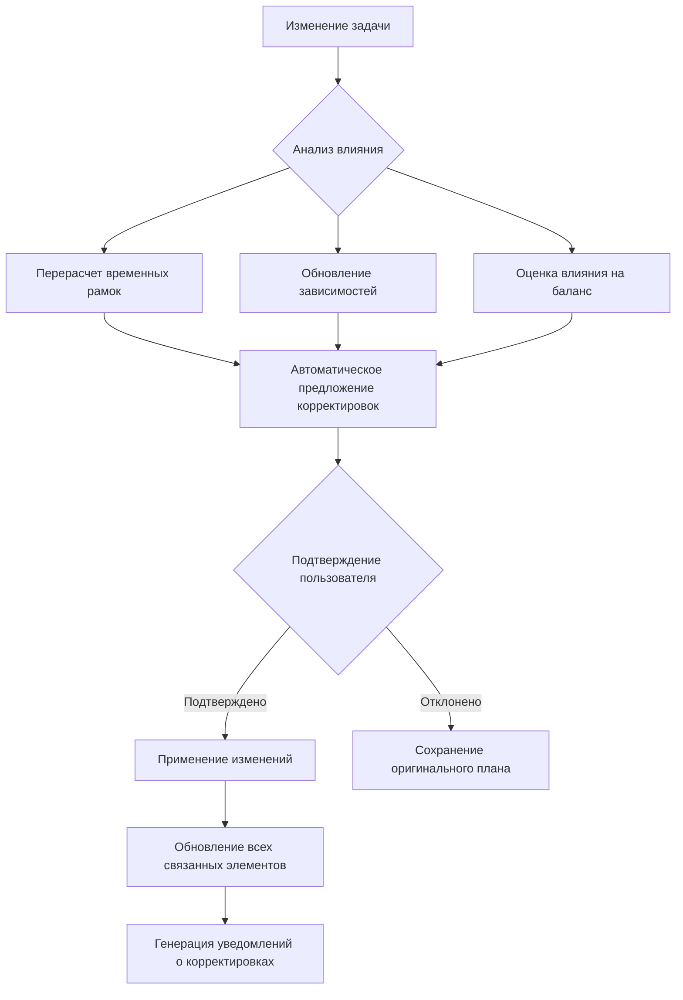

# harmony-project-description.md
# Подробное описание программы "Гармония": Система Управления Личной Эффективностью

## 1. Общее описание и философия

**"Гармония"** — это Progressive Web Application (PWA) для комплексного управления личной эффективностью, ориентированная на создание сбалансированной и осмысленной жизни через динамическое взаимодействие с вашими целями и планами. В отличие от традиционных систем тайм-менеджмента, "Гармония" фокусируется не просто на продуктивности, а на способности адаптировать вашу стратегию к изменяющимся обстоятельствам, сохраняя при этом баланс между всеми сферами жизни.

**Ключевые принципы:**
- **Динамическая адаптивность:** Система автоматически перестраивает вашу стратегию и тактику при любом изменении условий
- **Глубокая иерархия целей:** От видения до конкретных действий с прозрачными связями между уровнями
- **Проактивный ИИ-ассистент:** Не просто инструмент запросов, а активный помощник, предлагающий решения
- **Абсолютный суверенитет данных:** Локальное хранение по умолчанию, облачная синхронизация — опциональная платная функция
- **Гипербезопасность:** Защита от взлома и утечек как приоритет №1
- **Психологическая безопасность:** Отсутствие негативного воздействия, позитивный фокус

## 2. Схема данных системы "Гармония": Подробное описание и визуализация

### 2.1. Описание схемы данных

Схема данных системы "Гармония" представляет собой иерархическую структуру, отражающую взаимосвязи между различными элементами управления личной эффективностью. Эта схема построена вокруг концепции "Видения" как верхнего уровня, формирующего общий смысл и баланс жизни пользователя.

### 2.2. Основные сущности и их атрибуты

#### Видение
- **Описание:** Философская основа и жизненная позиция пользователя
- **Срок реализации:** Горизонт видения (обычно 10+ лет)
- **Атрибуты:**
  - Название
  - Детальное описание
  - Визуальное представление (изображение)
  - Оценка баланса жизни
  - Связанные глобальные цели

#### Глобальные цели
- **Описание:** Конкретные направления, вытекающие из видения
- **Срок реализации:** 3-5 лет
- **Атрибуты:**
  - Название
  - SMART-формулировка
  - Оценка прогресса
  - Связанные стратегические цели
  - Связь со сферами жизни

#### Стратегические цели
- **Описание:** Конкретные результаты, достижимые за год
- **Срок реализации:** 1 год
- **Атрибуты:**
  - Название
  - Ключевые результаты (KRs)
  - Приоритет
  - Связанные проекты
  - Связанные одинокие задачи
  - Оценка влияния на баланс

#### Проекты
- **Описание:** Группа задач, направленных на достижение конкретного результата
- **Срок реализации:** От нескольких недель до нескольких месяцев
- **Атрибуты:**
  - Название
  - Описание
  - Статус
  - Связанные подпроекты (2 уровня)
  - Связанные задачи
  - Оценка ресурсов

#### Подпроекты (уровень 1)
- **Описание:** Крупные компоненты проекта
- **Срок реализации:** От нескольких недель до месяца
- **Атрибуты:**
  - Название
  - Описание
  - Статус
  - Связанные подпроекты (уровень 2)
  - Связанные задачи

#### Подпроекты (уровень 2)
- **Описание:** Более детальные компоненты проекта
- **Срок реализации:** От нескольких дней до недели
- **Атрибуты:**
  - Название
  - Описание
  - Статус
  - Связанные задачи

#### Задачи
- **Описание:** Конкретные действия для достижения целей
- **Срок выполнения:** От одного дня до нескольких недель
- **Атрибуты:**
  - Название
  - Описание
  - Приоритет (матрица Эйзенхауэра)
  - Контекст (место, инструмент, энергия)
  - Связанные подзадачи
  - Статус выполнения

#### Подзадачи
- **Описание:** Мелкие шаги для выполнения задачи
- **Срок выполнения:** Обычно один день
- **Атрибуты:**
  - Название
  - Описание
  - Приоритет
  - Статус выполнения

#### Запись дневника
- **Описание:** Отражение мыслей, событий и состояния пользователя
- **Атрибуты:**
  - Дата и время
  - Текст записи
  - Аудио/изображение (опционально)
  - Психологическое состояние (оценка)
  - Эмоциональное состояние (оценка)
  - Физическое состояние (оценка)
  - Ссылки на: Видение, Цели, Проекты, Задачи
  - Сформированные идеи

#### Идеи
- **Описание:** Вдохновляющие концепции и мысли
- **Атрибуты:**
  - Название
  - Описание
  - Источник (запись дневника)
  - Анализ через Квадрат Декарта
  - Связанные цели/проекты
  - Статус (активная, спящая, реализованная)

#### Привычки
- **Описание:** Регулярные действия для поддержки целей
- **Атрибуты:**
  - Название
  - Описание
  - Частота выполнения
  - Текущий прогресс
  - Связанные цели/задачи
  - Время выполнения

### 2.3. Взаимосвязи между сущностями

#### Иерархическая структура
- **Видение → Глобальные цели:** Видение формирует и направляет глобальные цели (1 ко многим)
- **Глобальные цели → Стратегические цели:** Каждая глобальная цель состоит из множества стратегических целей (1 ко многим)
- **Стратегические цели → Проекты:** Стратегические цели реализуются через проекты (1 ко многим)
- **Стратегические цели → Одинокие задачи:** Некоторые стратегические цели могут включать отдельные задачи без проектной структуры (1 ко многим)
- **Проекты → Подпроекты (уровень 1):** Проекты могут быть разбиты на крупные компоненты (1 ко многим)
- **Подпроекты (уровень 1) → Подпроекты (уровень 2):** Крупные компоненты могут быть дополнительно детализированы (1 ко многим)
- **Подпроекты (уровень 2) → Задачи:** Детальные компоненты реализуются через задачи (1 ко многим)
- **Задачи → Подзадачи:** Задачи могут быть разбиты на мелкие шаги (1 ко многим)

#### Контекстные связи
- **Запись дневника → Видение:** Записи могут ссылаться на видение (многие ко многим)
- **Запись дневника → Цели:** Записи могут ссылаться на цели всех уровней (многие ко многим)
- **Запись дневника → Проекты/Подпроекты:** Записи могут ссылаться на проектные элементы (многие ко многим)
- **Запись дневника → Задачи/Подзадачи:** Записи могут ссылаться на задачи (многие ко многим)
- **Запись дневника → Идеи:** Записи могут формировать идеи (один ко многим)

#### Вдохновляющие связи
- **Идеи → Видение:** Идеи могут влиять на видение (многие ко многим)
- **Идеи → Цели:** Идеи могут приводить к созданию целей (многие ко многим)
- **Идеи → Проекты:** Идеи могут приводить к созданию проектов (многие ко многим)

#### Поддерживающие связи
- **Привычки → Цели:** Привычки поддерживают достижение целей (многие ко многим)
- **Привычки → Проекты:** Привычки поддерживают проекты (многие ко многим)
- **Привычки → Задачи:** Привычки поддерживают выполнение задач (многие ко многим)

### 2.4. Визуализация схемы данных

### 2.5. Пояснение схемы

#### 2.5.1. Иерархическая структура

Схема построена как древовидная иерархия, начинающаяся с **Видения**, которое формирует общий смысл и баланс жизни пользователя. От Видения расходятся **Глобальные цели** (3-5 лет), которые в свою очередь состоят из **Стратегических целей** (1 год).

Каждая Стратегическая цель реализуется через:
- **Проекты** (с возможной двухуровневой вложенностью подпроектов)
- **Одинокие задачи** (независимые задачи, не требующие проектной структуры)

Проектная структура включает два уровня подпроектов для детализации сложных проектов, что позволяет гибко управлять сложностью задач.

#### 2.5.2. Контекстные связи через Дневник

**Запись дневника** является центральным аналитическим узлом системы, связывающим все элементы:
- Может ссылаться на Видение для отражения соответствия действий жизненной философии
- Связана со всеми уровнями целей для анализа прогресса
- Связана с проектами и задачами для отслеживания выполнения
- Формирует Идеи на основе записей
- Фиксирует психологическое, эмоциональное и физическое состояние пользователя

#### 2.5.3. Вдохновляющие связи через Идеи

**Идеи** действуют как катализатор изменений в системе:
- Могут влиять на Видение, приводя к переосмыслению жизненных приоритетов
- Могут приводить к созданию новых целей всех уровней
- Могут инициировать создание новых проектов
- Обогащаются через Квадрат Декарта для глубокого анализа

#### 2.5.4. Поддерживающие связи через Привычки

**Привычки** обеспечивают устойчивую поддержку достижения целей:
- Поддерживают Глобальные цели через долгосрочные паттерны поведения
- Поддерживают Стратегические цели через регулярные действия
- Интегрированы с Проектами для обеспечения стабильного прогресса
- Связаны с Задачами для формирования микро-привычек

#### 2.5.5. Особенности схемы

1. **Иерархическая последовательно-параллельная структура:** Глобальные цели могут развиваться параллельно, но каждая из них имеет свою последовательную структуру.

2. **Гибкая проектная структура:** Возможность использования двухуровневой вложенности подпроектов для сложных проектов и прямого связывания задач с проектами для простых случаев.

3. **Централизованный анализ через дневник:** Все элементы системы могут быть связаны с записями дневника для глубокого анализа и рефлексии.

4. **Обратные связи:** Идеи могут влиять на Видение, создавая цикл постоянного развития и адаптации.

5. **Поддерживающая роль привычек:** Привычки действуют как устойчивый механизм поддержки достижения целей на всех уровнях.

Эта схема данных обеспечивает гибкую, но организованную структуру для управления личной эффективностью, где все элементы тесно связаны и влияют друг на друга, создавая целостную экосистему для достижения баланса и гармонии в жизни пользователя.

## 3. Архитектура приложения

### 3.1. Общая архитектура
- **Тип:** Progressive Web Application (PWA) с offline-first подходом
- **Клиентская часть:** React + Vite + TypeScript
- **Стили:** Tailwind CSS с глубокой кастомизацией через дизайн-систему
- **UI-компоненты:** shadcn/ui с адаптацией под дизайн-систему
- **Локальное хранилище:** IndexedDB с использованием Dexie.js для структурированного хранения
- **Шифрование:** Web Crypto API для end-to-end шифрования данных
- **Serverless-бэкенд (премиум):** Cloudflare Workers для синхронизации и обработки ИИ-запросов
- **Локальная векторная БД:** WASM-реализация векторной базы данных для семантического поиска в Базе знаний

### 3.2. Система распространения изменений

## 4. Основные модули и их взаимосвязи

### 4.1. Центр Жизни (Life Dashboard)
**Функции:**
- Визуализация баланса по 8 сферам жизни через радарную диаграмму
- Персонализируемая панель с виджетами
- Индикатор общего баланса жизни с рекомендациями
- Интеграция с ИИ для анализа текущего состояния

**Взаимосвязи:**
- Получает данные из всех модулей (цели, задачи, привычки, дневник)
- Отправляет рекомендации в модули планирования
- Связан с индикатором времени для отображения прогресса
- Реагирует на оперативные изменения через систему уведомлений

### 4.2. Цели (OKR++) & Видение
**Функции:**
- Уровни планирования: Видение (10+ лет) → Глобальные цели (3-5 лет) → Стратегические цели (1 год) → Квартальные OKR
- Гибкие OKR с привязкой к сферам жизни
- ИИ-анализ реалистичности целей
- **Система оперативных изменений:**
  - Автоматическое распространение изменений по иерархии
  - Визуализация "цепной реакции" при внесении изменений
  - Режим "Что-если" для моделирования последствий изменений
  - Предложение оптимальных корректировок с учетом баланса жизни
  - Возможность отката изменений с сохранением истории
- Интеграция с дневником для анализа прогресса

**Взаимосвязи:**
- Связан с модулем проектов (цели → проекты)
- Интегрирован с календарем (визуализация сроков)
- Связан с дневником (анализ прогресса)
- Интегрирован с модулем привычек (поддержка целей через привычки)

### 4.3. Проекты
**Функции:**
- Группировка задач для достижения конкретного результата
- Визуализация: Канбан-доски, Гант (упрощенный), списки
- Управление зависимостями между проектами
- **Система оперативных изменений:**
  - Автоматическое перераспределение ресурсов при изменении задач
  - Визуализация влияния изменений на сроки и зависимости
  - Предложение альтернативных путей достижения результатов
  - Возможность временного приостановления проекта с сохранением прогресса
- Интеграция с календарем для планирования сроков

**Взаимосвязи:**
- Привязан к целям (каждый проект поддерживает конкретную цель)
- Интегрирован с задачами (проекты состоят из задач)
- Связан с идеями (проекты могут возникать из идей)
- Интегрирован с календарем для отображения сроков

### 4.4. Задачи (GTD на стероидах)
**Функции:**
- Контексты: место, инструмент, энергия, тип
- Приоритеты: матрица Эйзенхауэра + кастомные метки
- **Система оперативных изменений:**
  - Автоматическое перераспределение при изменении условий
  - Предложение альтернативных временных слотов с учетом текущего баланса
  - Визуализация влияния отмены/переноса на связанные элементы
  - Режим "быстрого перепланирования" для срочных изменений
  - Возможность делегирования с автоматическим обновлением зависимостей
- **Шаблон SMART:**
  - Интерактивный пошаговый помощник для постановки задач
  - Шаг 1: Specific (Конкретная) - уточнение деталей задачи
  - Шаг 2: Measurable (Измеримая) - определение критериев успеха
  - Шаг 3: Achievable (Достижимая) - оценка ресурсов и возможностей
  - Шаг 4: Relevant (Релевантная) - проверка соответствия целям
  - Шаг 5: Time-bound (Ограниченная по времени) - установка дедлайна
  - ИИ-проверка корректности постановки задачи по критериям SMART
- Повторяющиеся задачи с гибкими правилами
- Подзадачи/чеклисты с возможностью делегирования

**Взаимосвязи:**
- Привязаны к проектам и целям
- Интегрированы с календарем (автоматическое распределение во времени)
- Связаны с дневником (отслеживание прогресса)
- Интегрированы с модулем привычек (задачи для развития привычек)

### 4.5. Календарь (Интегрированный & Умный)
**Функции:**
- Виды: День/Неделя/Месяц/Квартал
- Отображение защищенных временных блоков (отдых, семья)
- **Система оперативных изменений:**
  - "Умное" перетаскивание задачи с мгновенным перерасчетом зависимостей
  - Визуальные подсказки при конфликтах расписания
  - Автоматическое предложение оптимальных альтернатив при изменении условий
  - Индикаторы перегрузки по сферам жизни при добавлении задач
- Синхронизация с внешними календарями через OAuth
- Балансировка рабочих и личных задач

**Взаимосвязи:**
- Интегрирован со всеми модулями (отображает задачи, проекты, цели)
- Связан с ИИ-ассистентом для оптимизации расписания
- Интегрирован с модулем привычек (отображение привычек)
- Связан с дневником (отображение записей)

### 4.6. Дневник (Journal)
**Функции:**
- Многоформатная запись: текст, голос (через локальный Whisper), изображения (с OCR)
- Периодический анализ: недельный, месячный, квартальный, сезонный, годовой
- Контекстная связь с целями, проектами и задачами
- Локальная обработка записей и анализа
- Режим "Быстрый дневник" для записи за 5-10 секунд
- **Система оперативных изменений:**
  - Автоматическая связь записей с текущими изменениями в планах
  - ИИ-анализ причин изменений и их влияния на баланс
  - Возможность создания задач/целей из записей с автоматической интеграцией в систему
- **База знаний:**
  - Формирование персональной базы знаний на основе записей
  - Семантический поиск через локальную векторную БД
  - Кластеризация записей по темам и связям
  - Визуализация связей между записями
  - Возможность добавления меток и категорий для структурирования
  - Интеграция с ИИ-анализом для выявления скрытых паттернов

**Взаимосвязи:**
- Интегрирован с ИИ-анализом для выявления паттернов
- Связан с целями (анализ прогресса по целям)
- Интегрирован с задачами (отслеживание выполнения)
- Связан с модулем привычек (анализ формирования привычек)
- Интегрирован с Базой знаний (источник данных для знаний)

### 4.7. Модуль привычек
**Функции:**
- Постановка целей по развитию привычек
- Отслеживание регулярности с визуализацией прогресса
- Напоминания и мотивационные уведомления
- Анализ связи между привычками и достижением целей
- Режим "чередования привычек" для предотвращения выгорания
- **Система оперативных изменений:**
  - Автоматическая корректировка графика привычек при изменении расписания
  - Предложение альтернативных временных слотов для поддержания регулярности
  - Анализ влияния изменений в расписании на формирование привычек

**Взаимосвязи:**
- Привязан к целям (привычки поддерживают достижение целей)
- Интегрирован с календарем (планирование привычек)
- Связан с дневником (анализ формирования привычек)
- Интегрирован с модулем мотивации (подкрепление привычек)

### 4.8. Идеи & Инкубатор
**Функции:**
- Быстрый захват идей через глобальный хоткей
- Теги, категории, связь с целями/проектами/задачами
- **Квадрат Декарта для анализа идей:**
  - Интерактивный шаблон для анализа идей с четырех точек зрения:
    * Что будет, если идея реализуется?
    * Что будет, если идея не реализуется?
    * Чего не будет, если идея реализуется?
    * Чего не будет, если идея не реализуется?
  - ИИ-анализ каждого аспекта с рекомендациями
  - Визуализация результатов анализа через матрицу
  - Возможность сохранения результатов анализа для будущего референса
  - Интеграция с модулем целей для оценки соответствия идеи долгосрочному видению
- Система "спящие идеи" с напоминаниями
- Возможность преобразования идей в действия
- **Система оперативных изменений:**
  - Автоматическая связь идей с текущими изменениями в планах
  - Предложение интеграции идей в скорректированные планы
  - Анализ влияния изменений на приоритетность идей

**Взаимосвязи:**
- Интегрирован с целями (идеи могут стать целями)
- Связан с проектами (идеи могут стать проектами)
- Интегрирован с задачами (идеи могут стать задачами)
- Связан с дневником (фиксация идей из записей)

### 4.9. Социальные факторы и мотивация
**Функции:**
- Профиль мотивации пользователя
- Социальные триггеры: дележ достижений, нетворкинг
- Система "Доказательств" прогресса
- Техники преодоления прокрастинации
- Позитивное подкрепление через персонализированные сообщения
- **Система оперативных изменений:**
  - Автоматическая адаптация мотивационных стратегий при изменениях в планах
  - Предложение специфических техник для преодоления препятствий, возникающих из-за изменений
  - Анализ влияния изменений на уровень мотивации и предложения по корректировке
- **Регулярные опросы:**
  - Короткие еженедельные опросы об удовлетворенности сферами жизни
  - Оценка общего мировосприятия и эмоционального состояния
  - Накопление результатов для анализа трендов
  - Интеграция с ИИ-анализом для персонализированных рекомендаций
  - Визуализация динамики удовлетворенности по сферам жизни
  - Возможность добавления комментариев к оценкам

**Взаимосвязи:**
- Интегрирован с целями (поддержка достижения целей)
- Связан с задачами (борьба с прокрастинацией)
- Интегрирован с дневником (фиксация доказательств)
- Связан с модулем привычек (формирование мотивирующих привычек)

### 4.10. Уведомления и напоминания
**Функции:**
- **Централизованная система уведомлений:**
  - Напоминания на основе планов, задач и привычек
  - Прямое добавление событий/мероприятий пользователем
  - Автоматическая привязка к целям/проектам/задачам
  - Привязка к сферам жизни для анализа баланса
  - Добавление в календарь с возможностью настройки напоминаний
  - Гибкие настройки интервалов и типов уведомлений
  - Возможность отложить или перенести напоминание
  - Интеграция с внешними мессенджерами (Telegram, WhatsApp)
- **Интеллектуальное управление:**
  - ИИ-анализ важности и срочности уведомлений
  - Предложение оптимального времени для напоминаний
  - Фильтрация уведомлений по текущему состоянию пользователя
  - Автоматическое подавление несвоевременных уведомлений

**Взаимосвязи:**
- Интегрирован со всеми модулями системы
- Связан с календарем для отображения напоминаний
- Интегрирован с ИИ-ассистентом для оптимизации уведомлений
- Связан с дневником для анализа реакции на уведомления

### 4.11. Исторический контекст
**Функции:**
- **Система исторического контекста:**
  - Добавление информации о прошлых событиях и достижениях
  - Фиксация исторических проблем и их решений
  - Привязка исторических данных к текущим целям и планам
  - Анализ влияния прошлого на текущую ситуацию
  - Визуализация исторических паттернов и трендов
  - Возможность создания "уроков из прошлого" для будущих решений
- **Интеграция с ИИ-анализом:**
  - Автоматическое обнаружение связей между прошлым и настоящим
  - Предложение уроков из исторического контекста
  - Анализ повторяющихся проблем и их решений
  - Прогнозирование на основе исторических данных

**Взаимосвязи:**
- Интегрирован с дневником (источник исторических данных)
- Связан с целями (анализ влияния прошлого на достижение целей)
- Интегрирован с задачами (учет прошлого опыта при планировании)
- Связан с Базой знаний (источник данных для знаний)

### 4.12. Семейный раздел (в рамках сферы "Отношения")
**Функции:**
- **Генеалогическое древо:**
  - Визуализация семейных связей в древовидной структуре
  - Возможность добавления членов семьи с подробной информацией
  - Добавление комментариев и заметок к членам семьи (опционально)
  - Загрузка фотографий для визуализации
  - Возможность указания степеней родства
- **Семейные события:**
  - Управление памятными датами (дни рождения, юбилеи)
  - Хранение адресов и контактной информации
  - Отслеживание семейных событий и традиций
  - Напоминания о важных датах
  - Возможность добавления историй и семейных легенд
- **Семейный календарь:**
  - Интеграция с основным календарем
  - Отображение семейных событий в общем контексте
  - Возможность делегирования задач членам семьи
  - Анализ времени, проведенного с семьей

**Взаимосвязи:**
- Является частью сферы "Отношения"
- Интегрирован с календарем для отображения семейных событий
- Связан с модулем уведомлений для напоминаний о важных датах
- Интегрирован с дневником для фиксации семейных моментов

### 4.13. Сферы жизни (специализированные страницы)
**Функции:**
- **Специализированные страницы для каждой сферы жизни:**
  - Работа
  - Здоровье
  - Семья/Друзья
  - Развитие
  - Хобби
  - Отдых
  - Финансы
  - Духовность
- **Для каждой сферы:**
  - Персонализированная визуализация прогресса
  - Специфические метрики и показатели
  - Интеграция с релевантными целями и задачами
  - Связь с соответствующими записями дневника
  - Анализ трендов и динамики
  - Персонализированные рекомендации ИИ
  - Интеграция с Базой знаний для отображения релевантных записей
  - Связь с историческим контекстом для анализа прошлого опыта
- **Кросс-сферный анализ:**
  - Визуализация взаимовлияния сфер
  - Анализ баланса между сферами
  - Предложение корректировок для улучшения баланса
  - Прогнозирование влияния изменений в одной сфере на другие

**Взаимосвязи:**
- Интегрированы с Life Dashboard для общей визуализации
- Связаны с целями и задачами, относящимися к конкретной сфере
- Интегрированы с дневником для отображения релевантных записей
- Связаны с Базой знаний для отображения релевантных знаний

### 4.14. Индикатор времени
**Функции:**
- Персонализированный расчет на основе возраста
- Позитивное отображение **"Доступные возможности"** вместо "оставшихся возможностей"
- Акцент на уже успешно прожитом времени
- Контекстная связь с текущими целями
- Настройки отображения и психологической безопасности
- **Система оперативных изменений:**
  - Автоматическая корректировка прогнозов при изменениях в планах
  - Визуализация влияния изменений на долгосрочные перспективы
  - Предложение компенсационных действий для сохранения долгосрочных целей

**Взаимосвязи:**
- Интегрирован с целями (визуализация прогресса)
- Связан с дневником (анализ использования времени)
- Интегрирован с календарем (планирование оставшегося времени)
- Связан с Life Dashboard (общая визуализация баланса)

### 4.15. Интерактивная документация
**Функции:**
- **Контекстная справка:**
  - Всплывающие подсказки при наведении на элементы интерфейса
  - Краткое объяснение функционала с иллюстрациями
  - Возможность перехода к подробной документации по клику
- **Интерактивные туториалы:**
  - Пошаговые руководства по основным сценариям использования
  - Возможность выполнения действий в "учебном режиме" с подсказками
  - Персонализация туториалов на основе уровня опыта пользователя
- **Поиск по документации:**
  - Мгновенный поиск по всем разделам документации
  - Фильтрация по категориям (начинающие, продвинутые, ИИ-функции)
  - Сохранение истории поиска и часто просматриваемых разделов
- **Визуальные руководства:**
  - Интерактивные диаграммы связей между элементами системы
  - Анимированные примеры рабочих процессов
  - Возможность воспроизведения примеров в упрощенном режиме
- **Интеграция с ИИ:**
  - Персонализированные ответы на вопросы через ИИ-ассистента
  - Анализ текущего контекста для предоставления релевантной информации
  - Возможность задавать вопросы естественным языком
- **Система обратной связи:**
  - Оценка полезности документации
  - Возможность предложить улучшения
  - Отслеживание непонятных разделов для последующего улучшения
- **Обучение через практику:**
  - Интерактивные упражнения по применению методик (SMART, Квадрат Декарта)
  - Мгновенная проверка и обратная связь
  - Постепенное усложнение заданий

**Взаимосвязи:**
- Интегрирована со всеми модулями системы
- Связана с ИИ-ассистентом для предоставления контекстной помощи
- Связана с дневником для сохранения прогресса в обучении
- Интегрирована с профилем пользователя для персонализации

## 5. Система оперативных изменений (детализация)

### 5.1. Механизм распространения изменений
- **Анализ влияния:** При любом изменении система автоматически анализирует все зависимости и влияние на связанные элементы
- **Цепная реакция:** Визуализация всех затронутых элементов по всем уровням иерархии
- **Прогнозирование:** Предсказание последствий изменений на 30 дней вперед
- **Психологическая адаптация:** Учет текущего состояния пользователя для предложения наиболее приемлемых корректировок

### 5.2. Режимы оперативных изменений
- **Быстрый режим:** Одно нажатие для отмены/переноса задачи с автоматическим предложением корректировок
- **Глубокий режим:** Подробный анализ влияния изменений с возможностью ручной настройки корректировок
- **Режим "Что-если":** Моделирование последствий изменений без применения
- **Режим отката:** Восстановление предыдущего состояния с сохранением истории изменений

### 5.3. Визуализация влияния изменений
- **Цветовые индикаторы:** Зеленый (без негативного влияния), желтый (требует внимания), красный (серьезные последствия)
- **Графы зависимостей:** Интерактивная визуализация связей между элементами
- **Прогноз баланса:** Предсказание влияния изменений на баланс жизни
- **ИИ-рекомендации:** Персонализированные предложения по оптимальной корректировке

### 5.4. ИИ-ассистент оперативных изменений
- **Контекстный анализ:** Учет текущего состояния, энергии и приоритетов пользователя
- **Предложение альтернатив:** Генерация 3 вариантов корректировок с оценкой последствий
- **Объяснение рекомендаций:** Прозрачное объяснение, почему предлагаются те или иные изменения
- **Прогнозирование рисков:** Выявление потенциальных проблем, которые могут возникнуть из-за изменений

### 5.5. Система подтверждения изменений
- **Многоуровневое подтверждение:** Разный уровень подтверждения в зависимости от серьезности изменений
- **Предварительный просмотр:** Возможность увидеть результат изменений до их применения
- **История изменений:** Полная запись всех корректировок с возможностью отката
- **Коллаборативное подтверждение:** Для премиум-пользователей — возможность запросить мнение доверенных лиц перед применением серьезных изменений

## 6. Перечень страниц и их содержимое

### 6.1. Страница авторизации
- **Содержимое:**
  - Форма входа с локальной аутентификацией (пароль/PIN/биометрия)
  - Индикатор статуса безопасности
  - Ссылка на восстановление доступа
  - Опция выбора режима (базовый/премиум)
  - Информация о приватности данных
- **Особенности:**
  - Локальная аутентификация без передачи данных на сервер
  - Анимированные индикаторы безопасности
  - Темная тема по умолчанию для снижения стресса

### 6.2. Главная страница (Life Dashboard)
- **Содержимое:**
  - Радарная диаграмма баланса жизни по 8 сферам
  - Персонализируемая панель виджетов:
    * Предстоящее (ближайшие события)
    * Срочное (матрица Эйзенхауэра)
    * Фокус дня (ИИ-рекомендация)
    * Прогресс целей
    * Состояние энергии
  - Индикатор общего баланса с рекомендациями
  - Быстрый доступ к основным функциям
  - **Система оперативных изменений:**
    * Индикаторы недавних изменений
    * Быстрый доступ к режиму "Что-если"
    * История недавних корректировок
  - **Интерактивная документация:**
    * Контекстные подсказки по основным элементам
    * Быстрый доступ к туториалам
    * Индикатор прогресса в освоении системы
- **Особенности:**
  - Возможность персонализации расположения виджетов
  - Адаптивный интерфейс под разные размеры экранов
  - Интеграция с голосовым управлением

### 6.3. Страница целей
- **Содержимое:**
  - Иерархическое отображение целей (видение → глобальные → стратегические → OKR)
  - Интерактивная визуализация связей между уровнями
  - Панель управления для каждого уровня целей
  - Анализатор баланса по сферам жизни
  - История изменений и прогресса
  - **Система оперативных изменений:**
    * Визуализация влияния изменений на нижние уровни
    * Режим "Что-если" с прогнозированием последствий
    * Предложение альтернативных путей достижения целей
    * Система отката изменений
  - **Интерактивная документация:**
    * Пошаговое руководство по постановке целей
    * Визуальные примеры правильных и неправильных целей
    * Интегрированный шаблон SMART для целей
- **Особенности:**
  - Режим "прокрутки вниз" от глобальных целей к конкретным действиям
  - Индикаторы перекосов баланса при внесении изменений
  - Интеграция с ИИ-ассистентом для предложения корректировок

### 6.4. Страница проектов
- **Содержимое:**
  - Выбор вида отображения (Канбан, Гант, список)
  - Список проектов с фильтрацией и сортировкой
  - Детали проекта с прогрессом и зависимостями
  - Управление ресурсами (файлы, ссылки)
  - Связь с целями и задачами
  - **Система оперативных изменений:**
    * Визуализация влияния изменений задач на сроки проекта
    * Предложение альтернативных распределений ресурсов
    * Режим быстрого перепланирования при изменении условий
    * Индикаторы рисков при отмене/переносе задач
  - **Интерактивная документация:**
    * Пошаговое руководство по управлению проектами
    * Примеры успешных и проблемных проектов
    * Инструмент анализа проектов через Квадрат Декарта
- **Особенности:**
  - Drag & drop для управления задачами
  - Визуализация зависимостей между проектами
  - Интеграция с календарем для отображения сроков

### 6.5. Страница задач
- **Содержимое:**
  - Список задач с фильтрацией по контекстам и приоритетам
  - Детали задачи с подзадачами и вложениями
  - Панель ИИ-оптимизации расписания
  - Система "инбокс" для быстрого добавления задач
  - Статистика выполнения задач
  - **Система оперативных изменений:**
    * Режим "быстрого переноса" с предложением альтернативных слотов
    * Визуализация влияния отмены на связанные элементы
    * Предложение оптимальных альтернатив при изменении условий
    * Возможность мгновенного делегирования с обновлением зависимостей
  - **Шаблон SMART:**
    * Интерактивный пошаговый помощник
    * Проверка каждого критерия SMART
    * ИИ-рекомендации по улучшению формулировки
  - **Интерактивная документация:**
    * Пошаговое руководство по методике SMART
    * Примеры задач с разной степенью соответствия SMART
    * Интерактивный тренажер по постановке задач
- **Особенности:**
  - Автоматическое предложение временных слотов
  - Адаптивная система корректировки при изменении условий
  - Интеграция с голосовым вводом

### 6.6. Страница календаря
- **Содержимое:**
  - Выбор вида (День/Неделя/Месяц/Квартал)
  - Отображение задач, событий и защищенных временных блоков
  - Инструменты для планирования и перетаскивания задач
  - Интеграция с внешними календарями
  - Визуализация баланса рабочих и личных задач
  - **Система оперативных изменений:**
    * "Умное" перетаскивание с мгновенным анализом влияния
    * Визуальные подсказки при конфликтах расписания
    * Автоматическое предложение оптимальных альтернатив
    * Индикаторы перегрузки по сферам жизни
  - **Интерактивная документация:**
    * Пошаговое руководство по эффективному планированию
    * Визуальные примеры баланса и перегрузки
    * Интерактивный тренажер по распределению времени
- **Особенности:**
  - Цветовая кодировка по сферам жизни
  - Интеграция с модулем привычек (отображение привычек)
  - Режим "прогноза баланса" при добавлении новых задач

### 6.7. Страница дневника
- **Содержимое:**
  - Панель быстрого ввода (текст, голос, изображение)
  - Календарь записей с индикаторами активности
  - Детали записи с контекстной связью
  - Периодические обзоры (недельный, месячный и т.д.)
  - Система поиска и фильтрации записей
  - **Система оперативных изменений:**
    * Автоматическая связь записей с текущими изменениями в планах
    * ИИ-анализ причин изменений и их влияния на баланс
    * Возможность создания задач/целей из записей с интеграцией в систему
  - **База знаний:**
    * Автоматическое формирование знаний из записей
    * Семантический поиск через локальную векторную БД
    * Визуализация связей между знаниями
    * Интеграция с ИИ-анализом для расширения знаний
  - **Исторический контекст:**
    * Добавление информации о прошлых событиях
    * Анализ влияния прошлого на настоящее
    * Визуализация исторических паттернов
  - **Интерактивная документация:**
    * Пошаговое руководство по эффективному ведению дневника
    * Примеры записей, приводящих к прорывам
    * Интерактивные упражнения по рефлексии
- **Особенности:**
  - Локальный Whisper для распознавания речи
  - OCR-распознавание текста на изображениях
  - ИИ-анализ записей для выявления паттернов

### 6.8. Страница привычек
- **Содержимое:**
  - Список привычек с прогрессом выполнения
  - Детали привычки с историей и статистикой
  - Настройка правил и напоминаний
  - Анализ связи с целями
  - Режим "чередования привычек"
  - **Система оперативных изменений:**
    * Автоматическая корректировка графика привычек при изменении расписания
    * Предложение альтернативных временных слотов
    * Анализ влияния изменений в расписании на формирование привычек
  - **Интерактивная документация:**
    * Пошаговое руководство по формированию привычек
    * Примеры успешных стратегий
    * Интерактивный калькулятор времени формирования привычки
- **Особенности:**
  - Визуализация прогресса с графиками
  - Интеграция с календарем для отображения расписания
  - Позитивное подкрепление через персонализированные сообщения

### 6.9. Страница идей
- **Содержимое:**
  - Список идей с категориями и тегами
  - Детали идеи с возможностью редактирования
  - Инструменты преобразования идей в действия
  - Система "спящие идеи" с напоминаниями
  - Анализ связей с целями и проектами
  - **Квадрат Декарта:**
    * Интерактивный шаблон для анализа идеи
    * ИИ-поддержка заполнения каждого квадранта
    * Визуализация результатов через матрицу
    * Предложение дальнейших действий на основе анализа
  - **Система оперативных изменений:**
    * Автоматическая связь идей с текущими изменениями в планах
    * Предложение интеграции идей в скорректированные планы
    * Анализ влияния изменений на приоритетность идей
  - **Интерактивная документация:**
    * Пошаговое руководство по использованию Квадрата Декарта
    * Примеры анализа реальных идей
    * Интерактивный тренажер по анализу идей
- **Особенности:**
  - ИИ-классификация и группировка идей
  - Возможность добавления через голосовой ввод
  - Интеграция с дневником (фиксация идей из записей)

### 6.10. Страница мотивации
- **Содержимое:**
  - Профиль мотивации пользователя
  - Система "Доказательств" прогресса
  - Инструменты преодоления прокрастинации
  - Персонализированные сообщения поддержки
  - Настройка социальных триггеров
  - **Система оперативных изменений:**
    * Автоматическая адаптация мотивационных стратегий при изменениях в планах
    * Предложение специфических техник для преодоления новых препятствий
    * Анализ влияния изменений на уровень мотивации
  - **Регулярные опросы:**
    * Еженедельные опросы об удовлетворенности сферами жизни
    * Оценка мировосприятия и эмоционального состояния
    * Визуализация динамики удовлетворенности
    * Интеграция с ИИ-анализом для рекомендаций
  - **Интерактивная документация:**
    * Пошаговое руководство по поддержанию мотивации
    * Примеры преодоления типичных проблем
    * Интерактивные упражнения по повышению мотивации
- **Особенности:**
  - Pomodoro-таймер с ИИ-адаптацией
  - Разбивка задач на микро-шаги
  - Техника "Если-то" планирования

### 6.11. Страница уведомлений
- **Содержимое:**
  - Централизованный список уведомлений и напоминаний
  - Настройка типов уведомлений (планы, задачи, привычки, события)
  - Гибкие настройки интервалов и методов доставки
  - Автоматическая привязка к целям и сферам жизни
  - Интеграция с календарем для добавления событий
  - Интеграция с мессенджерами (Telegram, WhatsApp)
  - **Интеллектуальное управление:**
    * ИИ-анализ важности уведомлений
    * Предложение оптимального времени для напоминаний
    * Фильтрация по текущему состоянию пользователя
    * Система откладывания и переноса уведомлений
  - **Интерактивная документация:**
    * Пошаговое руководство по настройке уведомлений
    * Примеры эффективных стратегий уведомлений
    * Интерактивные упражнения по управлению уведомлениями
- **Особенности:**
  - Адаптивная система уведомлений
  - Интеграция с ИИ-ассистентом для оптимизации
  - Визуальные индикаторы приоритета уведомлений

### 6.12. Страница семейного раздела (в рамках сферы "Отношения")
- **Содержимое:**
  - **Генеалогическое древо:**
    * Визуализация семейных связей в древовидной структуре
    * Добавление членов семьи с подробной информацией
    * Добавление комментариев (опционально)
    * Загрузка фотографий для визуализации
    * Указание степеней родства
  - **Семейные события:**
    * Управление памятными датами
    * Хранение адресов и контактной информации
    * Отслеживание семейных событий и традиций
    * Напоминания о важных датах
    * Семейные истории и легенды
  - **Семейный календарь:**
    * Интеграция с основным календарем
    * Отображение семейных событий
    * Делегирование задач членам семьи
    * Анализ времени, проведенного с семьей
  - **Интерактивная документация:**
    * Пошаговое руководство по созданию генеалогического древа
    * Примеры эффективного управления семейной информацией
    * Интерактивные упражнения по работе с семейными данными
- **Особенности:**
  - Интуитивный интерфейс для создания древа
  - Интеграция с календарем для напоминаний
  - Возможность экспорта семейного древа

### 6.13. Страницы сфер жизни
- **Содержимое (для каждой сферы):**
  - **Работа:**
    * Анализ рабочих достижений и задач
    * Визуализация карьерного прогресса
    * Связь с профессиональными целями
    * Анализ баланса работы и отдыха
  - **Здоровье:**
    * Отслеживание физического состояния
    * Управление здоровыми привычками
    * Связь с медицинскими целями
    * Анализ влияния других сфер на здоровье
  - **Семья/Друзья:**
    * Управление отношениями и встречами
    * Анализ времени, проведенного с близкими
    * Связь с семейными целями
    * Интеграция с генеалогическим древом
  - **Развитие:**
    * Отслеживание обучения и навыков
    * Управление образовательными целями
    * Анализ прогресса в саморазвитии
    * Связь с проектами обучения
  - **Хобби:**
    * Управление хобби и увлечениями
    * Анализ времени, проведенного на хобби
    * Связь с творческими целями
    * Визуализация прогресса в хобби
  - **Отдых:**
    * Отслеживание времени отдыха
    * Управление отдыхом и восстановлением
    * Анализ качества отдыха
    * Связь с целями по восстановлению энергии
  - **Финансы:**
    * Анализ финансового состояния
    * Управление финансовыми целями
    * Отслеживание доходов и расходов
    * Связь с финансовыми проектами
  - **Духовность:**
    * Отслеживание духовного развития
    * Управление духовными практиками
    * Анализ внутреннего состояния
    * Связь с духовными целями
  - **Общие элементы для всех сфер:**
    * Визуализация прогресса по индивидуальным метрикам
    * Связь с релевантными целями и задачами
    * Интеграция с дневником для отображения релевантных записей
    * Анализ трендов и динамики
    * Персонализированные рекомендации ИИ
    * Интеграция с Базой знаний для отображения релевантных записей
    * Связь с историческим контекстом
  - **Интерактивная документация:**
    * Пошаговое руководство по работе с конкретной сферой
    * Примеры эффективного управления сферой
    * Интерактивные упражнения по развитию сферы
- **Особенности:**
  - Специализированный интерфейс для каждой сферы
  - Интеграция с релевантными модулями системы
  - Персонализированные рекомендации для каждой сферы

### 6.14. Страница индикатора времени
- **Содержимое:**
  - Визуализация **"Доступные возможности"**
  - Информация о прожитом времени
  - Контекстная связь с текущими целями
  - Настройки отображения и психологической безопасности
  - Альтернативные визуализации
  - **Система оперативных изменений:**
    * Автоматическая корректировка прогнозов при изменениях в планах
    * Визуализация влияния изменений на долгосрочные перспективы
    * Предложение компенсационных действий
  - **Интерактивная документация:**
    * Объяснение философии отображения времени
    * Примеры использования для планирования
    * Руководство по настройке под личные предпочтения
- **Особенности:**
  - Позитивное отображение без обратного отсчета
  - Автоматическое затемнение при признаках низкого настроения
  - Опция полного отключения с объяснением

### 6.15. Страница настроек
- **Содержимое:**
  - Профиль пользователя и настройки безопасности
  - Управление локальными данными
  - Настройки синхронизации (премиум)
  - Интеграция с мессенджерами
  - Настройки ИИ-ассистента
  - Настройки отображения и темы
  - **Система оперативных изменений:**
    * Настройка глубины анализа влияния изменений
    * Уровень автоматизации корректировок
    * Настройка уведомлений о необходимых корректировках
  - **Интерактивная документация:**
    * Пошаговое руководство по настройкам
    * Объяснение влияния каждой настройки
    * Рекомендации по оптимальной конфигурации
- **Особенности:**
  - Прозрачное управление разрешениями
  - Визуальные индикаторы безопасности
  - Настройка уровня детализации ИИ-анализа

### 6.16. Страница документации
- **Содержимое:**
  - Навигация по разделам документации
  - Поисковая система с фильтрацией
  - Интерактивные примеры и упражнения
  - Прогресс освоения системы
  - Обратная связь по документации
  - **Разделы документации:**
    * Основы системы: введение в концепцию "Гармонии"
    * Управление целями: пошаговые руководства по OKR и планированию
    * Работа с задачами: использование SMART, матрицы Эйзенхауэра
    * Анализ идей: применение Квадрата Декарта
    * Планирование времени: эффективное использование календаря
    * Формирование привычек: стратегии и техники
    * Дневник и рефлексия: методы анализа и саморазвития
    * База знаний: создание и использование персональной базы знаний
    * Исторический контекст: использование прошлого опыта
    * Управление уведомлениями: настройка и оптимизация
    * Семейный раздел: создание генеалогического древа
    * Сферы жизни: управление каждой сферой
    * Настройки и безопасность: управление данными и приватностью
    * ИИ-ассистент: возможности и ограничения
  - **Интерактивные элементы:**
    * Пошаговые руководства с возможностью выполнения действий
    * Визуальные примеры с возможностью изменения параметров
    * Интерактивные тренажеры для отработки навыков
    * Тесты для проверки понимания материала
    * Персонализированные рекомендации по дальнейшему обучению
- **Особенности:**
  - Адаптивная сложность: документация подстраивается под уровень пользователя
  - Интеграция с текущим контекстом: показывает релевантную информацию
  - Возможность сохранения заметок и закладок
  - Оффлайн-доступ к основным разделам

## 7. Технические особенности

### 7.1. Безопасность
- **Шифрование:**
  - AES-256-GCM для данных
  - HKDF для генерации ключей
  - PBKDF2-SHA512 для преобразования пароля в ключ
  - Ключи НИКОГДА не покидают устройство
  - Автоматическая смена ключей при подозрении на компрометацию

- **Защита от атак:**
  - XSS-защита через Content Security Policy (CSP)
  - CSRF-токены для всех запросов
  - Ограничение попыток входа с временной блокировкой
  - Обнаружение подозрительной активности через локальный анализ

- **Защита от копирования и взлома:**
  - Кодовая обфускация через Terser + Obfuscator.io
  - Проверка целостности кода при запуске
  - Обнаружение попыток модификации через integrity checks
  - Автоматическая блокировка при обнаружении неавторизованных изменений

### 7.2. Интеграция с ИИ
- **Локальный ИИ-движок (базовая версия):**
  - TensorFlow.js для локального анализа данных
  - Whisper.cpp для распознавания речи
  - Локальный TTS-движок для преобразования текста в речь
  - **Система оперативных изменений:**
    * Локальный анализ влияния изменений
    * Генерация рекомендаций по корректировке планов
    * Прогнозирование последствий изменений
    * Объяснимый ИИ: каждая рекомендация с пояснением
  - **База знаний:**
    * Локальная векторная БД через WASM
    * Семантический поиск через локальные ИИ-модели
    * Автоматическая кластеризация записей
    * Интеграция с дневником для формирования знаний

- **Serverless ИИ-API (премиум):**
  - Интеграция с OpenAI GPT-4o/Turbo, Claude, Gemini
  - Локальная предобработка данных перед отправкой
  - Пользовательский контроль над запросами к ИИ
  - Оптимизация запросов для снижения затрат

### 7.3. Синхронизация (премиум)
- **Механизм:**
  - Conflict-free Replicated Data Type (CRDT) для слияния изменений
  - End-to-end шифрование данных перед синхронизацией
  - Конфликт-менеджмент с визуальным сравнением версий
  - Синхронизация только по запросу или при наличии Wi-Fi

### 7.4. Голосовой интерфейс
- **Функции:**
  - Голосовой ввод с явным запросом разрешения
  - Локальный Whisper для распознавания речи
  - TTS-контроллер для озвучивания рекомендаций
  - Интеграция с мессенджерами для уведомлений
  - **Система оперативных изменений:**
    * Голосовые команды для быстрого внесения изменений
    * Голосовой анализ влияния изменений
    * Возможность подтверждения изменений голосом

### 7.5. Интерактивная документация
- **Техническая реализация:**
  - Интеграция с основным приложением через встроенные компоненты
  - Локальное хранение документации для оффлайн-доступа
  - Индексация контента для быстрого поиска
  - Адаптивный интерфейс под разные размеры экранов
  - Поддержка темного и светлого режимов

- **Интерактивные элементы:**
  - Встроенные кодовые примеры с возможностью запуска
  - Интерактивные диаграммы с возможностью изменения параметров
  - Пошаговые руководства с подсветкой элементов интерфейса
  - Тренажеры с мгновенной обратной связью
  - Персонализированные рекомендации на основе активности пользователя

- **Обновление документации:**
  - Автоматическая синхронизация с новыми версиями приложения
  - Интеграция с системой обратной связи для улучшения контента
  - Возможность пользовательских заметок и комментариев
  - Версионирование документации для отслеживания изменений

## 8. Особенности пользовательского опыта

### 8.1. Адаптивная сложность
- Интерфейс упрощается для новичков и расширяется по мере освоения
- Пошаговые туториалы для каждого модуля
- Интеллектуальные подсказки на основе поведения пользователя
- **Система оперативных изменений:**
  * Упрощенный интерфейс для быстрых изменений
  * Расширенный интерфейс для глубокого анализа
  * Контекстные подсказки при внесении изменений

### 8.2. Психологическая безопасность
- Все элементы дизайна проверены на отсутствие негативного воздействия
- Автоматическое затемнение при обнаружении признаков низкого настроения
- Опция полного отключения потенциально тревожных элементов
- **Система оперативных изменений:**
  * Оценка психологического воздействия изменений
  * Предложение менее стрессовых альтернатив
  * Индикаторы эмоциональной нагрузки при внесении изменений

### 8.3. Энергоэффективность
- Оптимизация для работы на слабых устройствах
- Режим энергосбережения с минимальной анимацией
- Адаптация под текущий уровень заряда батареи
- **Система оперативных изменений:**
  * Учет уровня энергии при предложении корректировок
  * Предложение менее энергозатратных альтернатив

### 8.4. Кросс-платформенность
- Единая кодовая база для всех платформ через PWA
- Адаптация под мобильные и десктопные интерфейсы
- Поддержка сенсорных жестов и мыши
- **Система оперативных изменений:**
  * Упрощенный интерфейс для мобильных устройств
  * Расширенный интерфейс для десктопов
  * Поддержка жестов для быстрых изменений

### 8.5. Интерактивная документация
- **Персонализация:**
  - Адаптация уровня сложности под опыт пользователя
  - Рекомендации на основе текущих задач и целей
  - Отслеживание прогресса в освоении системы
- **Контекстность:**
  - Показ релевантной информации в зависимости от текущего экрана
  - Интеграция с текущим контекстом работы
  - Возможность быстрого доступа к документации из любого места
- **Интерактивность:**
  - Возможность выполнения действий в учебном режиме
  - Мгновенная обратная связь на действия пользователя
  - Интерактивные примеры с возможностью изменения параметров

## 9. Критерии успеха

1. **Безопасность:** нулевые инциденты утечки данных за первые 2 года работы
2. **Производительность:** время отклика < 100ms для всех локальных операций
3. **Юзабилити:** 95% пользователей могут начать использовать систему без обучения
4. **Баланс жизни:** 80% пользователей отмечают улучшение баланса за 3 месяца
5. **Удержание:** 70% пользователей продолжают использовать систему спустя 6 месяцев
6. **Время работы с системой:** не более 5 минут в день при получении ценности
7. **Мотивация:** 80% пользователей отмечают снижение прокрастинации за 1 месяц
8. **Позитивный эффект:** 90% пользователей не испытывают негативных эмоций от интерфейса
9. **Эффективность изменений:** 85% пользователей отмечают, что система помогает успешно адаптироваться к изменениям
10. **Качество корректировок:** 75% пользователей принимают ИИ-предложения по корректировке планов
11. **Освоение функционала:** 80% пользователей осваивают основные функции через интерактивную документацию
12. **Полезность документации:** 90% пользователей считают документацию полезной и понятной
13. **База знаний:** 70% пользователей активно используют Базу знаний через 2 месяца использования
14. **Семейный раздел:** 60% пользователей создают генеалогическое древо в течение 3 месяцев
15. **Сферы жизни:** 85% пользователей регулярно просматривают и обновляют информацию по конкретным сферам

"Гармония" представляет собой не просто планировщик задач, а полноценную операционную систему для осмысленной и сбалансированной жизни, которая уважает ваше время, ваши данные и вашу жизнь в целом. Система активно помогает вам адаптироваться к изменениям, сохраняя фокус на главном, делая локальное хранение и автономную работу стандартом, а облачные функции — действительно полезным дополнением, а не необходимостью. Архитектура следует фундаментальному принципу: ваши данные принадлежат вам, и они остаются с вами, пока вы сами не решите иначе.

ВНИМАНИЕ!!!
Важно реализовать полный функционал для всех разделов, страниц, виджетов и т.д. Нельзя использовать разного рода заглушки и/или иммитации.

Использование различных заглушек ЗАПРЕЩЕНО!!!

Рассуждай, думай и общайся сос мной ТОЛЬКО на русском языке!