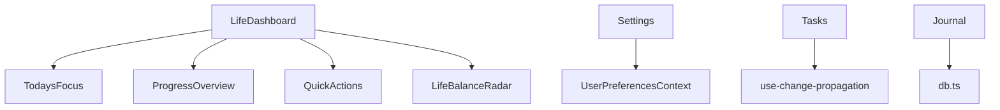
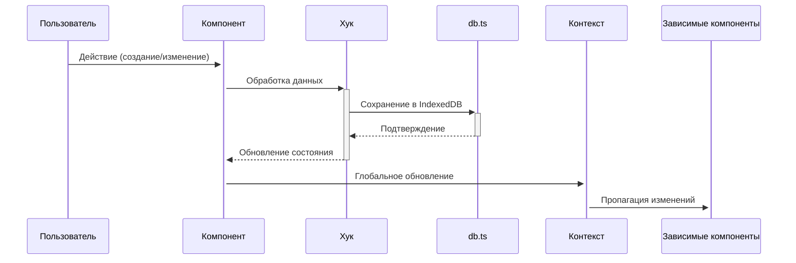

# Функциональность системы "Гармония"

## 1. Компоненты системы

### 1.1. Основные компоненты интерфейса
- **`LifeBalanceRadar`**: Визуализация баланса по 8 сферам жизни с интерактивными элементами
- **`LifeDashboard`**: Главный дашборд с виджетами:
  - Баланс жизни
  - Сегодняшний фокус
  - Прогресс по целям
  - Быстрые действия
- **`LifeSpheresNavigation`**: Навигация между 8 сферами жизни (Работа, Здоровье, Семья/Друзья и др.)
- **`MermaidChart`**: Отображение диаграмм Mermaid для визуализации связей и процессов
- **`ProgressOverview`**: Отслеживание прогресса выполнения целей
- **`TodaysFocus``: Управление задачами с приоритетами на текущий день
- **`UpcomingTasks``: Просмотр предстоящих задач

### 1.2. Страницы приложения
- **`Analytics`**: Аналитика продуктивности и баланса жизни
- **`Auth``: Аутентификация и регистрация пользователей
- **`Calendar``: Управление задачами в календарном виде
- **`FamilyFriends``: Управление семейными связями и генеалогическим древом
- **`Goals``: Постановка и отслеживание целей (глобальные, стратегические)
- **`Habits``: Создание и отслеживание привычек
- **`Ideas``: Система управления идеями
- **`Journal``: Персональный дневник с поддержкой медиа
- **`Notifications``: Управление уведомлениями
- **`Projects``: Управление проектами и задачами
- **`Settings``: Настройки приложения (безопасность, уведомления, ИИ)
- **`Tasks``: Управление задачами

### 1.3. Ключевые модули
- **`src/lib/db.ts`**: Работа с IndexedDB (хранение зашифрованных данных)
- **`src/lib/sync.ts``: Синхронизация данных между устройствами
- **`src/lib/crypto.ts``: Шифрование данных (AES-256-GCM, HKDF)
- **`src/lib/vector-db.ts``: Семантический поиск и анализ данных
- **`src/hooks/use-change-propagation.ts``: Распространение изменений по цепочке задач
- **`src/hooks/useSpeechRecognition.ts``: Интеграция с Web Speech API для голосового ввода

## 2. Взаимосвязи и зависимости

### 2.1. Зависимости компонентов

### 2.2. Потоки данных
1. Пользователь создает задачу в `Tasks.tsx`
2. Изменение триггерит хук `use-change-propagation.ts`
3. Обновленные данные сохраняются через `db.ts` в IndexedDB
4. `LifeDashboard` получает обновления через контекст
5. Виджеты дашборда обновляются в реальном времени

## 3. Внешние данные и интеграции

### 3.1. Внешние данные
- **Локальные данные**: Хранятся в IndexedDB с шифрованием
- **Пользовательские данные**: Цели, задачи, привычки, журналы
- **Аналитические данные**: Сбор метрик продуктивности и баланса

### 3.2. Внешние интеграции
- **Web Speech API**: Голосовой ввод в `useSpeechRecognition.ts`
- **Браузерные API**: IndexedDB, Service Workers (PWA)
- **Криптографические библиотеки**: Реализация AES-256-GCM, HKDF
- **Векторные базы данных**: Для семантического поиска (HNSW)

## 4. Архитектура системы

### 4.1. Общая архитектура
- **Клиентское PWA-приложение**: React + TypeScript
- **Хранение данных**: IndexedDB с клиентским шифрованием
- **Состояние**: React Context + Локальное состояние компонентов
- **Стили**: Tailwind CSS + Shadcn UI компоненты

### 4.2. Потоки данных

### 4.3. Безопасность
- Все данные шифруются на клиенте перед сохранением
- Ключи шифрования никогда не покидают устройство пользователя
- Аутентификация через локальное хранилище

### 4.4. Производительность
- Оптимизированные запросы к IndexedDB
- Мемоизация компонентов
- Ленивая загрузка неиспользуемых модулей